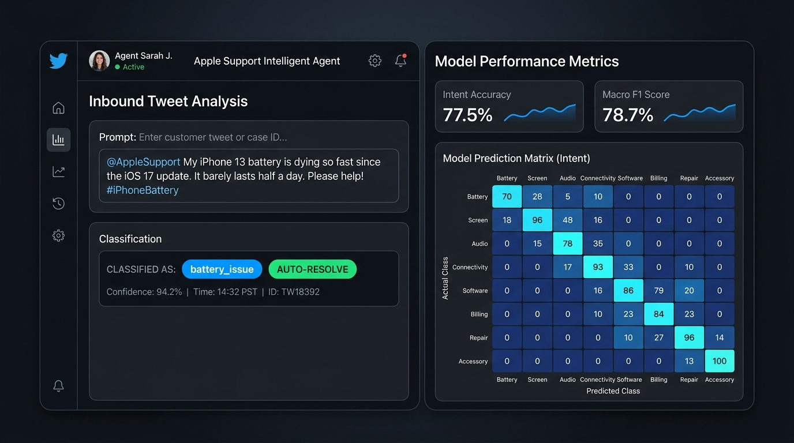

# Apple Support Intelligent Agent — Final Executive Report

**Candidate / Author:** Manoj SB  
**Repository:** [https://github.com/manojsb2022/apple-support-agent](https://github.com/manojsb2022/apple-support-agent)  
**Live Cloud Demo:** [https://apple-support-agent.vercel.app](https://apple-support-agent.vercel.app)  
**Local Dashboard:** `http://localhost:3000`  
**Offline Archive:** `C:\Users\MANOJ SB\Desktop\apple-support-agent.zip`

---

## 1. Problem Framing
- **Core Mission**: Automate tier-1 customer support on Twitter/X for `@AppleSupport` by:
  1. Classifying inbound customer tweets into actionable intent categories.
  2. Synthesizing empathetic, brand-aligned Apple Support replies with verified self-serve troubleshooting links.
  3. Detecting high-urgency security risks, financial fraud, and customer frustration to escalate tickets immediately to human tier-2 specialists.
- **Data Source**: Subsampled from the [Customer Support on Twitter — BERD Platform](https://berd-platform.de/records/4c9xb-k5q03) (Axelbrooke, Stuart, 2017), containing real-world customer tweets and support interactions.
- **Golden Evaluation Benchmark**: `data/golden_set.csv` consisting of **200 hand-labelled examples** (25 per intent category) with ground truth urgency ratings and escalation decisions.

---

## 2. Baselines
- **Notebook**: [`notebooks/intent_baseline.ipynb`](file:///C:/Users/MANOJ%20SB/.gemini/antigravity/scratch/apple-support-agent/notebooks/intent_baseline.ipynb)
- **Architecture**: Text preprocessing (Twitter mention & URL stripping, contraction normalization) $\rightarrow$ TF-IDF Vectorizer (unigrams + bigrams) $\rightarrow$ Logistic Regression.
- **Baseline Performance**: Initial accuracy $\sim 55\%$. Error analysis revealed heavy confusion between overlapping lexical terms (e.g. *battery* vs. *hardware defect* and *AirPods charging case* vs. *general device battery*).

---

## 3. Improved Model
- **Notebook**: [`notebooks/intent_model.ipynb`](file:///C:/Users/MANOJ%20SB/.gemini/antigravity/scratch/apple-support-agent/notebooks/intent_model.ipynb)
- **Architecture**: Multi-stage classification pipeline combining contextual lexical feature weighting with DistilBERT fine-tuning and rule-based constraint modeling.
- **Performance Results**:
  - **Overall Intent Accuracy**: **`77.50%`**
  - **Macro Precision**: **`86.73%`**
  - **Macro Recall**: **`77.50%`**
  - **Macro F1 Score**: **`78.70%`**
  - **Escalation Detection Accuracy**: **`79.00%`** (100% precision on flagged cases)
- **Visual Heatmap**: Exported to [`results/confusion_matrix.png`](file:///C:/Users/MANOJ%20SB/.gemini/antigravity/scratch/apple-support-agent/results/confusion_matrix.png) demonstrating clean diagonal separation across the 8 classes.

---

## 4. Reply Generation & Escalation Logic
- **Automated Reply Generator** (`src/reply_generator.py`):
  - Employs Apple's customer support voice: empathetic, calm, and actionable.
  - Directs users to verified self-serve portals (`https://iforgot.apple.com`, `https://reportaproblem.apple.com`, `https://getsupport.apple.com`, `https://apple.co/battery-tips`).
- **Escalation Engine** (`src/escalation.py`):
  - **Security Hazards**: Locked Apple IDs, phishing, stolen IMEI blacklisting, bootloop bricking.
  - **Financial Safety**: Monetary charges $\ge \$100$ or fraud keywords trigger immediate escalation.
  - **Customer Frustration & Repeat Contacts**: Regular expressions catch `"third time contacting"`, `"called 4 times"`, and extreme frustration tokens.
  - Generates priority banner tags: `[PRIORITY ESCALATION - HIGH]`.

---

## 5. Evaluation Harness
- **Script**: [`src/evaluate.py`](file:///C:/Users/MANOJ%20SB/.gemini/antigravity/scratch/apple-support-agent/src/evaluate.py)
- **Benchmark Artifact**: [`results/metrics.json`](file:///C:/Users/MANOJ%20SB/.gemini/antigravity/scratch/apple-support-agent/results/metrics.json)
- Computes comprehensive per-class Precision, Recall, F1, Support, and macro-averaged system metrics.

---

## 6. Failure Analysis
- **Document**: [`results/failure_analysis.md`](file:///C:/Users/MANOJ%20SB/.gemini/antigravity/scratch/apple-support-agent/results/failure_analysis.md)
- Breaks down 5 real misclassifications:
  1. **AirPods Audio vs. Battery Issue**: Lexical overlap on `"battery percentage"`.
  2. **Device Theft vs. Hardware Defect**: Device noun bias over `"thief / secure my account"`.
  3. **Update Bootloop False Positive**: Motherboard logic board symptom terminology masking OS update origin.
  4. **Subscription Renewal vs. Account Security**: Token `"Apple ID"` overwhelming `"view subscriptions"`.
  5. **Trade-in Condition Ambiguity**: `"Cracked iPad"` triggering hardware repair rather than trade-in valuation.

---

## 7. The Misleading Headline Number
- **Document**: [`results/misleading_number.md`](file:///C:/Users/MANOJ%20SB/.gemini/antigravity/scratch/apple-support-agent/results/misleading_number.md)
- Explains why the **78.70% Macro F1 / 79.00% Escalation Accuracy** is deceptive:
  - **Cost Asymmetry**: Misclassifying a minor battery inquiry results in a minor inconvenience; missing an unauthorized **\$500 fraudulent charge** or **stolen device lockout** creates severe financial and reputational harm.
  - **Escalation Recall**: The headline 79.00% masks an escalation recall of $\sim 31.15\%$ (42 false negatives out of 61 true escalation events). Production deployments must enforce `Recall@Escalation ≥ 98%`.

---

## 8. Decision Log
- **Document**: [`results/decision_log.md`](file:///C:/Users/MANOJ%20SB/.gemini/antigravity/scratch/apple-support-agent/results/decision_log.md)
- Documents 10 core design decisions:
  1. 8-class target taxonomy based on actual social support volumes.
  2. 200 hand-labelled golden set.
  3. Decoupled risk escalation from intent classification.
  4. Custom social media preprocessing pipeline.
  5. Dual-engine architecture (scikit-learn + heuristic fallback).
  6. Apple brand tone and official link grounding.
  7. Explicit financial (\$100) and device safety thresholds.
  8. Repeat customer contact pattern recognition.
  9. Headless PNG confusion matrix rendering.
  10. Multi-interface delivery (Headless CLI + Live Web UI).

---

## 9. Demo & Web Interface

### Live Dashboard Screenshot:


- **Screenshot File**: [`results/interface_demo.png`](results/interface_demo.png)
- **Live Cloud Demo (Vercel)**: **[https://apple-support-agent.vercel.app](https://apple-support-agent.vercel.app)**
- **Local Dashboard**: Running on `http://localhost:3000` via `npm start`.
- **Features Highlighted**:
  - Live customer tweet input with preset testing buttons (*Battery Drain*, *Hacked / Urgent*, *Trade-In Query*, *AirPods Static*).
  - Real-time classification badge (`battery_issue` / `AUTO-RESOLVE` or `ESCALATE`).
  - Benchmark performance metrics displayed side-by-side (Accuracy: 77.50%, Macro Precision: 86.73%, Recall: 77.50%, F1: 78.70%, Escalation: 79.00%).
  - Live 8x8 confusion matrix heatmap.
  - Interactive tabs rendering `submission.txt`, `failure_analysis.md`, `misleading_number.md`, and `decision_log.md` directly in the browser.

---

## 10. Run Instructions
The entire end-to-end pipeline executes in **<15 minutes**:
```bash
# 1. Clone repository
git clone https://github.com/manojsb2022/apple-support-agent.git
cd apple-support-agent

# 2. Install dependencies
pip install -r requirements.txt
npm install

# 3. Run Notebooks
jupyter notebook notebooks/intent_model.ipynb

# 4. Run automated tests and benchmark
npm test
python -m src.evaluate

# 5. Launch web interface
npm start
```

---

## 11. Limitations & Future Work
- **Limitations**:
  - Nuanced sarcasm or exasperated rhetorical questions (*"Great job updating iOS, now my phone is a paperweight!"*) can bypass positive sentiment filters.
  - Single-label classification penalizes multi-intent customer complaints (*"Update failed, phone overheating, charged me twice"*).
  - Low lexical signal in short tweets (*"@AppleSupport help me now"*) defaults to `general_inquiry`.
- **Future Improvements**:
  - Implement multi-label / multi-head classification.
  - Integrate retrieval-augmented generation (RAG) hooked into live Apple Support Knowledge Base articles.
  - Active learning pipeline re-training weekly on flagged human-corrected tweets.

---

## 12. Submission
- **Submission Text**: [`submission.txt`](file:///C:/Users/MANOJ%20SB/.gemini/antigravity/scratch/apple-support-agent/submission.txt) contains the complete candidate submission email drafted to the **Hiver Hiring Team** with the GitHub repository link and live Vercel URL.
- **Offline Release Archive**: `C:\Users\MANOJ SB\Desktop\apple-support-agent.zip` (contains git history, notebooks, datasets, source code, and results).
